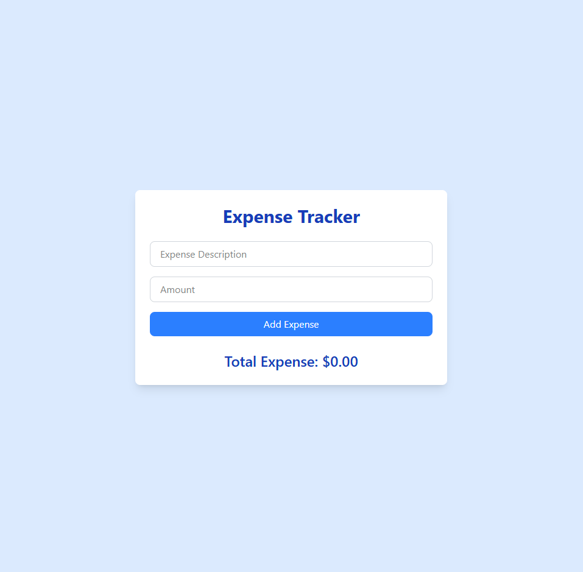

# 💸 Expense Tracker – Mini App
A simple and clean expense tracking app built with React, TypeScript, Zustand, and Tailwind CSS. This tool helps users manage and track their personal expenses by allowing them to add and remove expenses with real-time total calculation. Data is stored in the browser using localStorage.

## 🖼 UI Preview

## 📦 Features
✅ Add new expenses with a description and amount

✅ View a list of all recorded expenses

✅ Delete expenses

✅ See the total amount spent

✅ Responsive and minimal UI using Tailwind CSS

✅ Global state with Zustand and persisted using localStorage

## 🛠 Tech Stack
React – UI library

TypeScript – For type safety

Zustand – Global state management

Tailwind CSS – Styling with utility classes

localStorage – Client-side persistence using Zustand’s persist middleware

