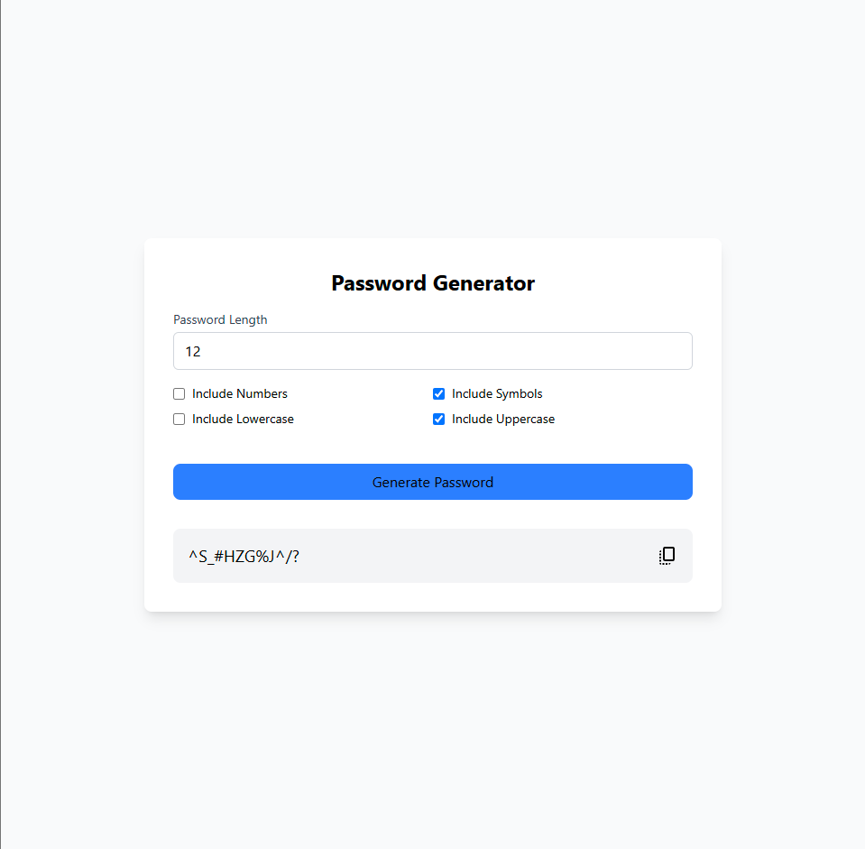

# 🔐 Password Generator – Mini App
A customizable and secure password generator built using React, TypeScript, Zustand, and Tailwind CSS. Users can create strong passwords by selecting character types and setting the desired length. The app’s logic is fully handled by Zustand’s global store, making it clean, reactive, and easy to scale.

## ✨ Features
✅ Generate strong, random passwords

✅ Toggle:

✅ Numbers (0123)

✅ Symbols (@#$%)

✅ Uppercase letters (A-Z)

✅ Lowercase letters (a-z)

✅ Adjust password length dynamically

✅ Passwords update instantly with one click

✅ Global state handled with Zustand

✅ Styled with responsive Tailwind CSS

## 🧠 How It Works
The app uses a Zustand store (usePasswordStore) to manage:

| Property            | Description                      |
| ------------------- | -------------------------------- |
| `length`            | Password length (default: 12)    |
| `includeNumbers`    | Include numeric characters (0–9) |
| `includeSymbols`    | Include special symbols          |
| `includeUppercase`  | Include uppercase letters        |
| `includeLowercase`  | Include lowercase letters        |
| `generatedPassword` | Resulting password               |

## 🛠 Tech Stack
React – UI rendering

TypeScript – Type-safe development

Zustand – Global and reactive state store

Tailwind CSS – Utility-first responsive design
