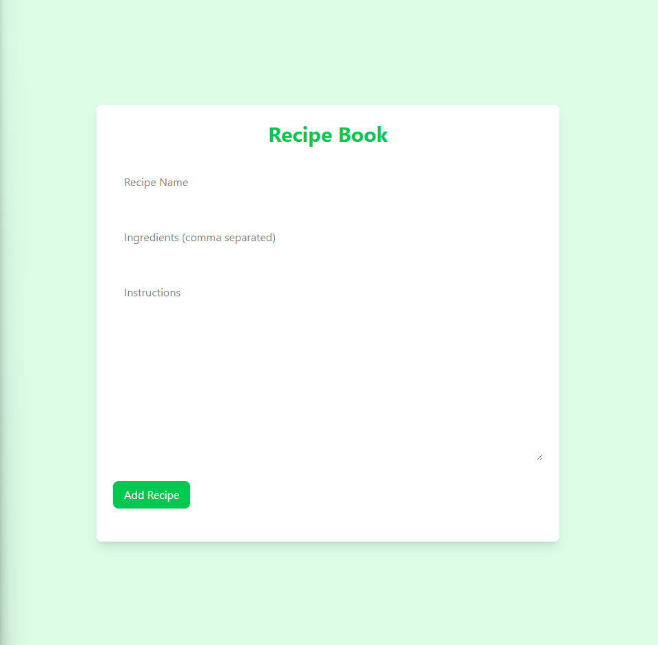

# 🧾 Recipe Book – Mini App
This is a simple recipe management app built with React, TypeScript, Zustand, and Tailwind CSS. It allows users to create, edit, and delete their favorite recipes. All data is saved in the browser using localStorage, so the recipes persist between sessions.

## 🖼 UI Preview

🧠 Features
✅ Add recipes with a name, ingredients, and instructions

✅ Edit existing recipes

✅ Delete recipes from your list

✅ All data is stored in localStorage

✅ Clean and responsive UI using Tailwind CSS

✅ State management with Zustand

✅ Type safety using TypeScript

✅ Global state with Zustand and persisted using localStorage

🛠️ Tech Stack
React – UI library

TypeScript – Strong typing support

Zustand – Simple state management

Tailwind CSS – Utility-first styling

📝 Notes
Ingredients are entered as a comma-separated list.

Editing a recipe removes the original and replaces it with the updated one.

Error validation ensures all fields are filled before submitting.