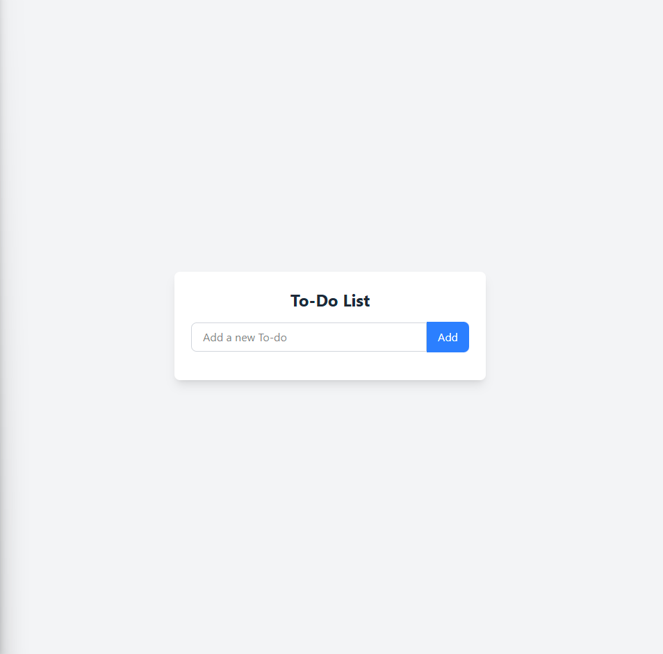

# ✅ Todo List – Mini App
A simple and clean to-do list app built with React, TypeScript, Zustand, and Tailwind CSS. It supports adding, checking off, and deleting tasks, while persisting the list in localStorage thanks to Zustand’s persist middleware.

## 🖼 UI Preview

## ✨ Features
✅ Add new to-dos with a button or by pressing Enter

✅ Toggle task completion using a checkbox

✅ Delete tasks individually

✅ Visual feedback for completed tasks (line-through)

✅ Tasks are persisted in localStorage

✅ Fully responsive and accessible UI with Tailwind CSS

✅ Global state management via Zustand

## 📦 Tech Stack
React – Frontend library

TypeScript – Type safety and clarity

Zustand – Global state manager (with persistence)

Tailwind CSS – Utility-first responsive design

localStorage – Client-side data persistence

